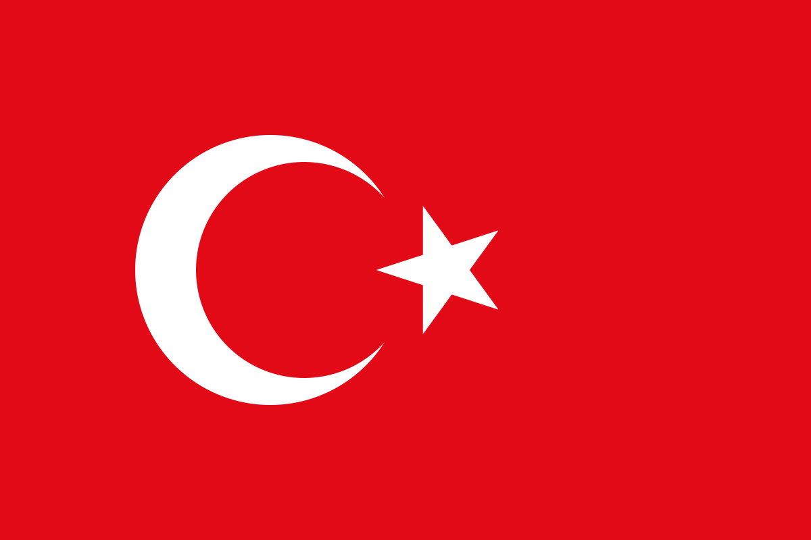

# Selim Koç

**Software Engineer**  -  **Full Stack Developer**

Building web apps end-to-end — architecture, backend, frontend, and deployment.

---

### 🚀 What I'm building

- **[selimkoc.dev](https://selimkoc.dev)** — a macOS-inspired desktop portfolio (TanStack Start, Prisma/Neon, Three.js)
- **[feedTune](https://github.com/Sselimkoc/feedTune)** — an RSS & YouTube subscription reader
- **[modern-gym](https://github.com/Sselimkoc/modern-gym)** — a modern fitness studio website

### 🛠️ Tech Stack

---

🎮 I write code for a living. I play games to win.

